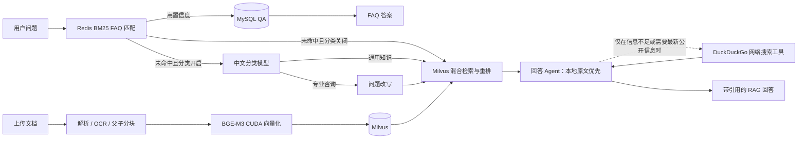

# RAG Agentic：本地电商知识库与问答服务

一个面向电商场景的本地 RAG 知识库项目。它把 FAQ、商品/运营文档和大模型问答串成一条可管理、可追溯的链路：高置信度 FAQ 直接命中，其他问题经过分类、改写、混合检索、重排后生成带引用的答案。

> 本项目的管理 API 没有认证，只能绑定到 `127.0.0.1`。请勿把它暴露到局域网或公网。

## 功能概览

- FAQ：MySQL 持久化问答对，以问题 MD5 为主键；Redis 缓存问题文本，BM25 + 归一化分数用于快速命中。
- 文档入库：支持 TXT、MD、DOCX、PDF、PPT/PPTX。PDF 与演示文稿经 MinerU 解析；超过 99 页的 PDF 自动拆分后处理。
- 结构化父子分块：Markdown 标题、表格、代码块保留结构；子块约 300 字符、相邻重叠 50 字符；约 5 个子块组成一个父块，父块相邻共享 1 个子块。
- 向量检索：BGE-M3 生成 1024 维稠密向量与稀疏词法向量，存入现有 Milvus collection `document_chunks_v2`。
- 问答路由：FAQ 未命中时，可由微调/蒸馏后的中文小模型判断“通用知识”或“专业咨询”；两类问题都会先进入本地 Milvus RAG，专业咨询额外执行问题改写。分类关闭时原问题也会直接进入本地 RAG。
- RAG 回答：稠密/稀疏混合检索、父块回查、BGE reranker 重排，并返回引用原文；本地 RAG 原文始终高于网络摘要。
- 会话记忆：服务端生成稳定 `session_id`，按会话在 MySQL 持久化 `0–256` 轮对话；每次仅选择与当前问题相关的历史和压缩摘要参与改写与回答。
- 模块控制：Vue 工作台可持久开关 FAQ（MySQL + Redis）和意图分类；关闭任一模块会跳过它直接进入 RAG。
- 本地管理 API：管理 QA、上传文档、查询异步入库任务、删除已入库文档及其 Milvus 父子块。

## 运行链路



### 联网工具的调用规则

`search_web` 是只交给回答 Agent 的 DuckDuckGo 工具，不是分类器的固定分支：

- Agent 先读取 Milvus 返回并经 BGE Reranker 筛选后的本地父块；本地内容足以回答时不联网。
- 只有本地上下文缺失、需要补充公开信息或需要较新的公开知识时，Agent 才能调用一次或多次 `search_web`。
- 网络摘要只能补充，不能覆盖本地原文；发生冲突时以本地原文为准。接口的 `web_search_used`、`web_citations` 会如实反映本次是否实际联网。
- 当前大模型端点必须支持 OpenAI 兼容的 tool calling；若端点不支持，服务会记录错误并安全降级为只使用本地 RAG，不会在检索前偷偷联网。

## 项目结构

```text
base/                     配置加载、统一日志
admin_api/                本地知识库管理 FastAPI 服务（端口 8001）
query_api/                面向用户的问答 FastAPI 服务（端口 8000）
conversation_memory/      会话 ID、MySQL 历史轮次、摘要与相关记忆选择
mysql_qa/                 MySQL FAQ、Redis warmup 与 BM25 匹配
dataprocess/              文档解析、MinerU、父子分块、BGE-M3、Milvus 写入
question_rewrite/         专业咨询问题改写策略与 OpenAI 兼容模型调用
rag_qa/                   混合检索、父块回查、重排与带引用回答
model_trian_classify/     中文分类教师训练、学生蒸馏与运行时路由
frontend/                 Vue 3 + TypeScript 本地客服工作台（端口 5173）
tests/                    不依赖真实数据库/模型的单元测试
docker-compose.yml        MySQL、Redis、Milvus、etcd、MinIO 本地基础设施
.env.example              可提交的配置模板
```

## 前置条件

- Python 3.10（由 `.python-version` 固定）
- [uv](https://docs.astral.sh/uv/)
- Node.js 20 或更高版本（用于 Vue 工作台）
- Docker Desktop（Linux containers）
- 可选：NVIDIA GPU + 可用 CUDA。BGE-M3 与分类训练检测到 CUDA 后会使用 GPU；分类训练要求 CUDA，不会静默回退 CPU。

本地模型目录不提交到 Git：

```text
models/bge-m3/                            BGE-M3 向量模型；用于 Milvus 稠密/稀疏混合检索
models/bge-reranker-large/                BGE Reranker Large；用于召回父块的 GPU 重排序
models/bert-base-chinese/                 BERT-Base-Chinese；用于分类教师模型训练
model_trian_classify/model/best_model/     四层中文 RoBERTa 蒸馏学生模型；用于运行时意图分类
```

运行时模型加载关系：BGE-M3 由 `dataprocess/embedding.py` 使用，BGE Reranker Large 由 `rag_qa/reranker.py` 使用，意图分类模型由 `model_trian_classify/query_router.py` 从 `model_trian_classify/model/best_model/` 加载。检测到 CUDA 时，向量化、重排序和分类推理都会优先使用 `cuda:0`。

## 更新日志

完整记录见 [CHANGELOG.md](CHANGELOG.md)。本次更新包括：

- 修复本地 BGE Reranker 与 Transformers 的兼容性，并恢复 GPU 重排序。
- FAQ 使用 jieba 分词与全量 Redis 问题 softmax 置信度；MySQL 读取事务快照已修复。
- 所有 RAG 问题先完成 Milvus 检索与重排；回答 Agent 再自行决定是否调用 DuckDuckGo 工具补充公开信息，回答提示词规定本地原文优先。
- 新增 MySQL 会话记忆：支持 `0–256` 轮保留、历史摘要与相关历史选择；Vue 工作台提供会话列表、上传文档、FAQ 导入和响应开关。
- 接入 LangSmith 对问题改写与 RAG 回答的调用追踪。
- 已完成第二版发布验收：全量 Python 测试 71 项通过、Ruff 与 Mypy 检查通过、Vue 生产构建通过；本机会话 API、管理 API 和 Vue 工作台均已启动验证。

## 快速开始

### 1. 创建本地配置

```powershell
Copy-Item .env.example .env
```

编辑 `.env`，至少替换以下占位符：

- `MYSQL_PASSWORD`、`MYSQL_ROOT_PASSWORD`
- `REDIS_PASSWORD`
- `MILVUS_PASSWORD`
- `MINIO_ACCESS_KEY`、`MINIO_SECRET_KEY`
- `REWRITE_LLM_API_KEY`（需要调用改写/回答模型时）
- `MINERU_API_KEY`（上传 PDF、PPT/PPTX 时）

`.env`、`uploads/`、日志、Docker 卷和模型产物均已被 Git 忽略。不要把真实密钥写入 README、代码或提示词记录。

### 2. 安装依赖

```powershell
uv sync --locked --all-groups
```

`uv.lock` 是可复现环境的唯一解析依据；`requirements.txt` 由锁文件导出，仅用于兼容 `pip` 的部署场景。

### 3. 启动本地基础设施

```powershell
docker compose up -d
docker compose ps
```

服务仅映射到本机回环地址：

| 服务 | 本机地址 | 用途 |
| --- | --- | --- |
| MySQL 8.4 | `127.0.0.1:3306` | FAQ 与入库任务审计 |
| Redis 7.4 | `127.0.0.1:6379` | FAQ 问题缓存 |
| Milvus 2.5.27 | `127.0.0.1:19530` | 文档块向量检索 |
| Milvus health | `127.0.0.1:9091` | 健康检查 |
| etcd / MinIO | Docker 内部网络 | Milvus 依赖 |

首次启动会下载较大的 Milvus 镜像，等待 `docker compose ps` 中所有服务变为 `healthy` 再启动 API。

### 4. 启动服务

在三个 PowerShell 窗口中分别运行：

```powershell
# 本地知识库管理 API
uv run uvicorn admin_api.main:app --host 127.0.0.1 --port 8001

# 用户问答 API
uv run uvicorn query_api.main:app --host 127.0.0.1 --port 8000

# Vue + TypeScript 本地工作台
Set-Location frontend
npm.cmd install
npm.cmd run dev
```

交互式接口文档：

- 管理 API：http://127.0.0.1:8001/docs
- 问答 API：http://127.0.0.1:8000/docs
- Vue 工作台：http://127.0.0.1:5173

`src/streamlitFrontend/` 在迁移期仍保留，Vue 工作台验收后再移除 Streamlit 依赖和旧页面。

## 管理 API

所有管理接口仅适用于本机开发环境。

| 方法 | 路径 | 说明 |
| --- | --- | --- |
| `POST` | `/admin/qa` | 新增或覆盖一条 QA |
| `POST` | `/admin/qa/import` | 导入 CSV 或 JSONL QA |
| `GET` | `/admin/qa?limit=50&offset=0` | 分页查询 QA |
| `DELETE` | `/admin/qa` | 按 `question_ids` 批量删除 QA |
| `POST` | `/admin/documents` | 上传单个文档，立即返回异步 `job_id` |
| `GET` | `/admin/documents/jobs/{job_id}` | 查询单个入库任务 |
| `GET` | `/admin/documents` | 查询任务历史 |
| `DELETE` | `/admin/documents/{job_id}` | 删除已完成任务的 Milvus 块和原文件 |

QA 导入文件固定字段为 `question,answer`。相同问题以 MD5 主键覆盖，MySQL 成功提交后会用 Redis Transaction 原子替换整个 FAQ Hash；若 Redis warmup 失败，接口返回 `503`，不会伪造成功。

问答 API 还提供仅本机访问的模块控制接口：`GET /runtime/features` 查询状态，`PATCH /runtime/features` 更新 `faq_enabled` 与 `classifier_enabled`。状态存储在 MySQL 中，首次启动默认均为 `true`。Docker Compose 已为 MySQL 配置持久化卷、为 Redis 配置 AOF 和持久化卷，两个服务均以 `unless-stopped` 自动恢复。

### 示例：新增和查询 FAQ

```powershell
Invoke-RestMethod -Method Post `
  -Uri http://127.0.0.1:8001/admin/qa `
  -ContentType 'application/json' `
  -Body '{"question":"如何申请退货？","answer":"请在订单详情页发起退货申请。"}'

Invoke-RestMethod -Uri 'http://127.0.0.1:8001/admin/qa?limit=50&offset=0'
```

### 示例：导入 QA 与上传文档

```text
# qa.csv
question,answer
如何退款？,请在订单详情页申请退款。
```

```powershell
curl.exe -X POST http://127.0.0.1:8001/admin/qa/import -F "file=@qa.csv"
curl.exe -X POST http://127.0.0.1:8001/admin/documents -F "file=@manual.pdf"
```

文档最大 100MB，支持 `.txt`、`.md`、`.docx`、`.pdf`、`.ppt`、`.pptx`。后台 worker 单线程执行 OCR、向量化和 Milvus 写入，避免并发 GPU OOM。服务重启时未完成的 `PENDING/RUNNING` 任务会标为 `FAILED`，不会自动重放。

## 用户问答 API

```powershell
# 首次创建会话
$session = Invoke-RestMethod -Method Post `
  -Uri http://127.0.0.1:8000/sessions `
  -ContentType 'application/json' `
  -Body '{"memory_turn_limit":12}'

Invoke-RestMethod -Method Post `
  -Uri http://127.0.0.1:8000/query `
  -ContentType 'application/json' `
  -Body ("{`"question`":`"你们的退货期限是多久？`",`"session_id`":`"{0}`"}" -f $session.session_id)
```

响应包含：

- `answer`：最终答案
- `source`：`faq` 或 `rag`
- `classification`、`classification_confidence`：未命中 FAQ 时的路由结果
- `citations`：父块引用（`source`、章节路径、原文）
- `faq_confidence`、`fallback_reason`：FAQ 匹配与兜底信息
- `session_id`、`turn_number`、`selected_memory_turns`：本轮会话和实际采用的历史数量
- `web_search_used`、`web_citations`：回答 Agent 是否实际调用联网搜索及其网页来源

会话接口：`POST /sessions` 创建会话；`GET /sessions` 查看会话列表；`GET /sessions/{session_id}/turns` 读取历史；`PATCH /sessions/{session_id}` 更新标题或 `memory_turn_limit`；`DELETE /sessions/{session_id}` 删除会话与记忆。设置为 `0` 时不会保存或注入对话内容。

已有 `document_chunks_v2` collection 保持当前 schema 不变。若需将已有 collection 的稠密索引显式切换为 IVF_FLAT，请在维护窗口执行：

```powershell
uv run python -m dataprocess.milvus_index --yes
```

## 训练分类模型

训练数据默认位于 `model_trian_classify/data_for_classify/`。训练使用 `bert-base-chinese` 教师模型，完成后以四层中文 RoBERTa 学生模型蒸馏；指标和训练日志写入被忽略的 `model_trian_classify/logs/`，模型写入被忽略的 `model_trian_classify/model/`。

```powershell
# 仅训练教师模型
uv run python -m model_trian_classify teacher

# 仅蒸馏学生模型
uv run python -m model_trian_classify student

# 顺序执行两阶段
uv run python -m model_trian_classify all
```

## 质量检查

```powershell
uv sync --locked --all-groups
uv run pytest
uv run ruff check .
uv run mypy base
git diff --check
```

单元测试使用替身隔离 MySQL、Redis、Milvus、LLM 和 MinerU；实际连通性验证应在 Docker 服务健康且 `.env` 已配置后进行。

## 开发与安全约定

- 共享配置通过 `from base import settings` 使用，日志通过 `from base import get_logger` 获取；统一日志输出到 `log/app.log`。
- 新增 Python 包时同时更新 `pyproject.toml`、`uv.lock` 和 `requirements.txt`。
- 从 `devlop` 创建功能分支；测试、检查、人工审查完成后再合并到 `master`。
- 任何已泄露或误提交的 API Key/密码都应立即撤销和轮换，而不仅仅是删除文本。
